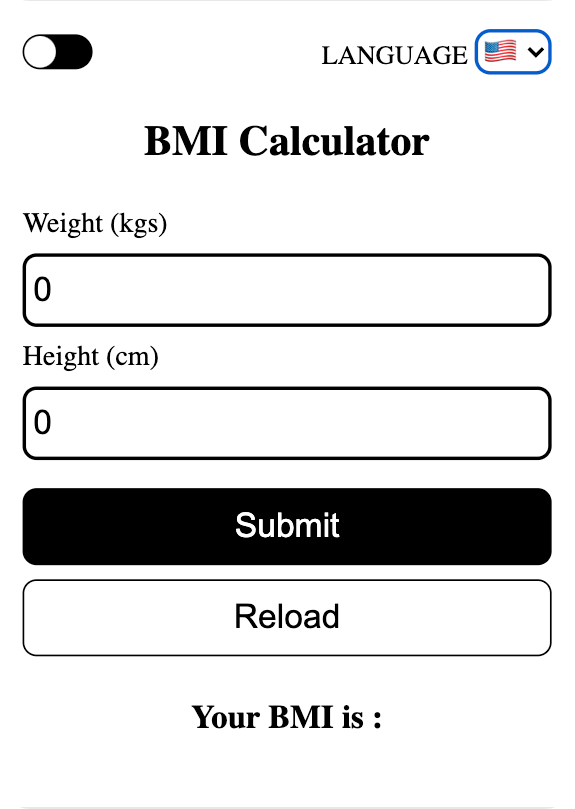
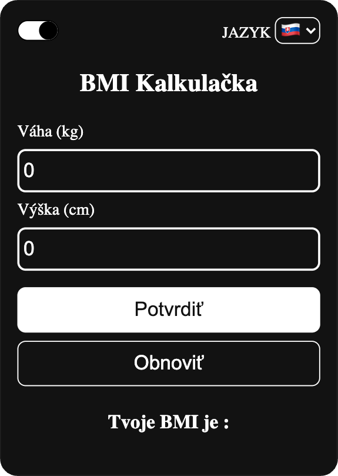

# Body Mass Index (BMI) 

Body Mass Index app is created with React. It calculates body mass index
for the individual and based on values it prints your health status 
including your BMI and emoji based on this value.

* including language support for English , Slovakia users with i18next
* loading animation based on react-spinners
* support dark mode which remember previous mode via local storage
* checking unusual values and writing an alert
* reloading app using button 

## Light Mode 

  

## Dark Mode 

  

[i18next](https://www.i18next.com/) , [react-spinners](https://www.davidhu.io/react-spinners/), 

bootstrapped with [create react app](https://github.com/facebook/create-react-app)

This project is under General Public Licence 3.0 ([GPL 3.0](https://www.gnu.org/licenses/gpl-3.0.html))
